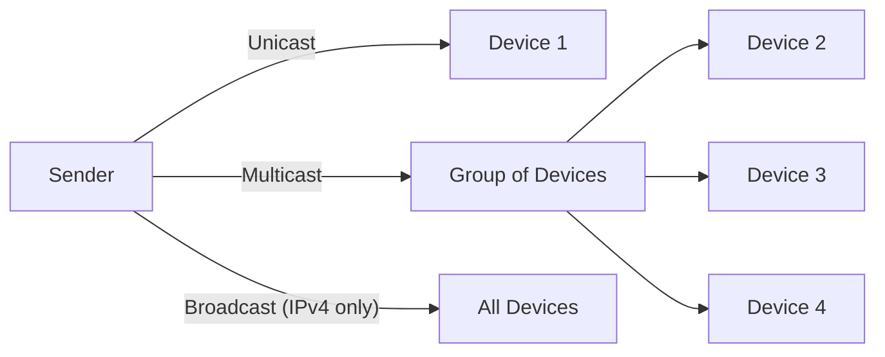
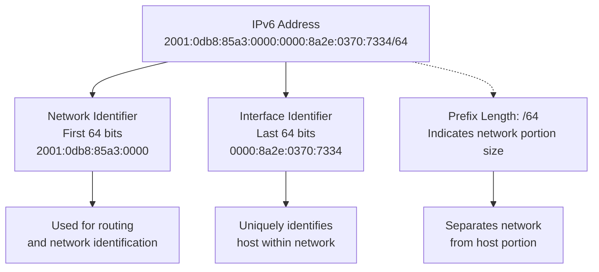
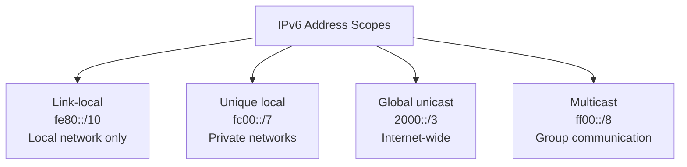

# PCNA Summer Term 2025
## Department of Computer Science and Engineering

---

# Preparation for Lab Exercise Sheet 2: IPv6 Topology

> **Important:** The following questions must be prepared for the laboratory and presented to the examiners before the start of the exercises.

## Student Information

- **Group No.:** 4
- **Name:** Zakaria Boujana
- **Matr. No.:** _______________

---

## General Questions on IPv6

**Get familiar with the IP Version 6 address format! Answer the following questions and tasks:**

### a) IPv6 Address Format
**Question:** Explain the format that is used for IPv6 addresses and give the maximum number of devices that can be addressed!

**Answer:**
IPv6 addresses are 128 bits long and written as eight groups of four hexadecimal numbers, separated by colons. Example: 2001:0db8:85a3:0000:0000:8a2e:0370:7334. IPv6 can support up to 2^128 addresses, which is enough for every device in the world.

---

### b) Communication Types in IPv6
**Question:** Explain the difference between Unicast, Multicast, and Broadcast in IPv6! *(Prepare a diagram)*

**Answer:**
- **Unicast:** Message goes from one device to one specific device.
- **Multicast:** Message goes from one device to a selected group of devices.
- **Broadcast:** (Not used in IPv6! Instead, multicast is used. In IPv4, broadcast sends a message to all devices in the network.)

**Diagram:**

---

### c) IPv6 Address Structure
**Question:** Explain the structure of IPv6 addresses and the terms Network Identifier, Interface Identifier, and Prefix Length! *(Prepare a diagram)*

**Answer:**
An IPv6 address has two main parts:

- **Network Identifier (network prefix):** Identifies the network (like a street name)
- **Interface Identifier:** Identifies the device on that network (like a house number)
- **Prefix Length:**
  - Shows how many bits are used for the network identifier
  - Written after a slash (/) — for example: /64

**Example:**
- `2001:0db8:85a3:0000:0000:8a2e:0370:7334/64`
- `2001:0db8:85a3:0000` = network identifier (first 64 bits)
- `0000:8a2e:0370:7334` = interface identifier (last 64 bits)

**Diagram:**

---

### d) IPv6 Address Scope
**Question:** What is an IPv6 address scope? Name and explain the different scopes of IPv6! *(Prepare a table and diagram)*

**Answer:**
- **Link-local:** Used for communication on the same local network; not routable over the internet.
- **Unique local:** Like private addresses in IPv4 (10.x.x.x, 192.168.x.x); for internal use only.
- **Global unicast:** Can be routed worldwide; unique for every device on the internet.
- **Multicast:** Sends to multiple devices at once; scope set by address (e.g., link-local multicast).

**Scope Table:**
| Scope Name         | Description                                             | Example Prefix |
| ------------------ | ------------------------------------------------------- | -------------- |
| **Link-local**     | Only valid within the same local network segment (link) | `fe80::/10`    |
| **Unique local**   | Valid within a site or organization (private networks)  | `fc00::/7`     |
| **Global unicast** | Valid everywhere (public internet, world-wide)          | `2000::/3`     |
| **Multicast**      | For one-to-many communication; scope varies by address  | `ff00::/8`     |

**Diagram:**

---